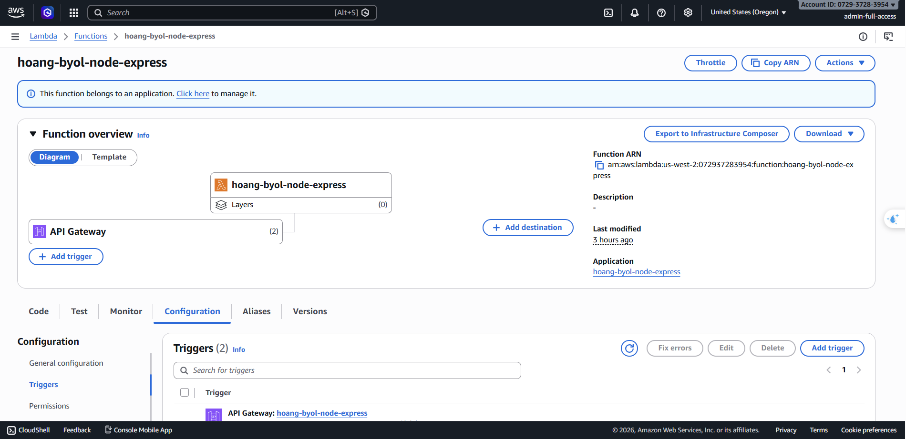
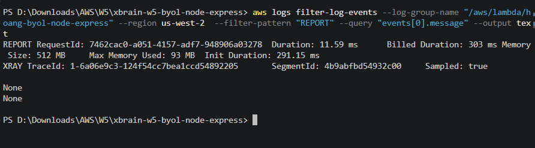

# NOTES — Chiến lược đưa Express lên Lambda



## Lựa chọn: Strategy A — `serverless-http`

## Lý do chọn

1. **Ít code nhất** — chỉ thêm 1 file `lambda.js` (4 dòng), không đụng vào `app.js`
2. **Đơn giản** — chỉ cần wrap app Express bằng `serverless(app)` là Lambda hiểu
3. **Cold start thấp** — khoảng 200–400ms, chấp nhận được cho hầu hết use case
4. **Cộng đồng lớn** — package `serverless-http` có hàng triệu lượt tải/tuần, stable, ít bug
5. **Không cần cấu hình Layer** — khác với Lambda Web Adapter (Strategy C) cần thêm Layer ARN

## Cold Start

Init Duration: 291.15 ms 

### So sánh nhanh với các option khác

| Strategy | Ưu điểm | Nhược điểm |
|----------|----------|------------|
| A. `serverless-http` ✅ | Đơn giản nhất, 3 dòng code | Thêm 1 dependency |
| B. `@vendia/serverless-express` | Tương tự A, có thêm middleware support | Package lớn hơn, maintenance không đều |
| C. Lambda Web Adapter | Zero JS changes | Cần config Layer, thêm complexity ở infra |
| D. Roll your own | Hiểu sâu internal | 30–80 dòng code, dễ bug (path stripping, headers...) |

### Cách hoạt động

```
API Gateway → Lambda → lambda.handler → serverless-http → Express app → response
```

`serverless-http` làm nhiệm vụ:
- Chuyển Lambda event (từ API Gateway) thành HTTP request mà Express hiểu
- Chuyển Express response ngược lại thành Lambda response format

### File đã thay đổi/thêm

- `lambda.js` — file mới, Lambda handler entry point
- `package.json` — thêm `serverless-http` vào dependencies
- `template.yaml` — đổi `Handler: TODO_FILL_IN` → `Handler: lambda.handler`


